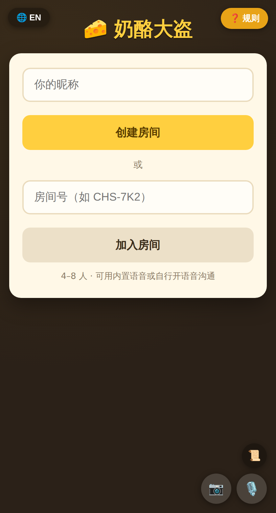
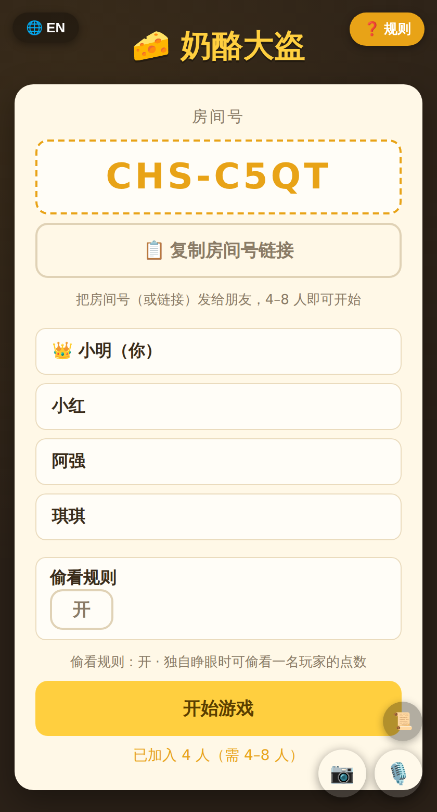
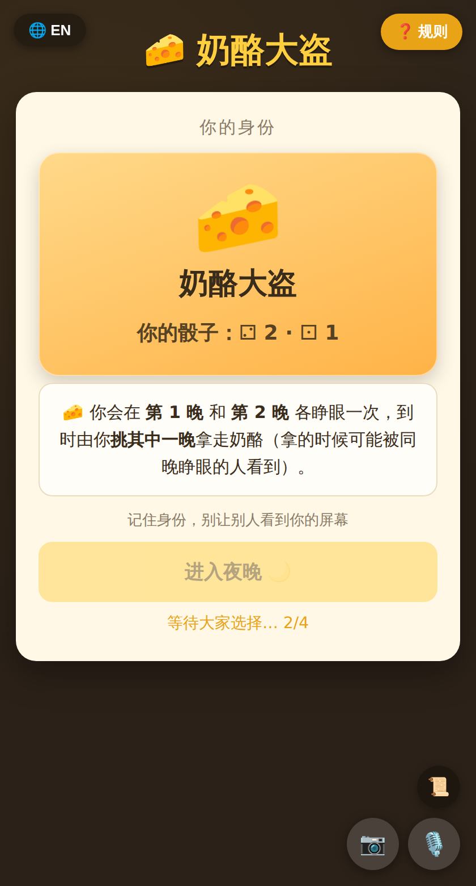
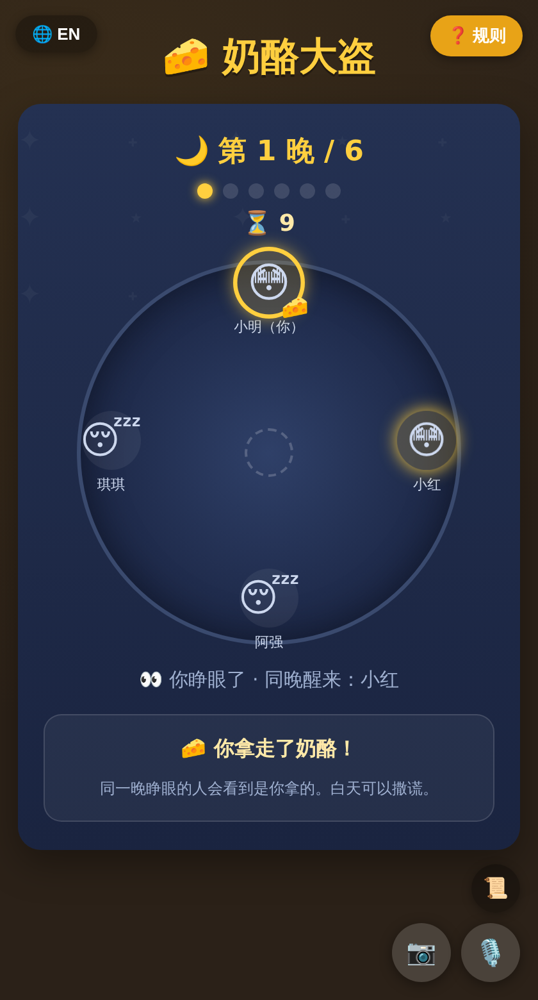
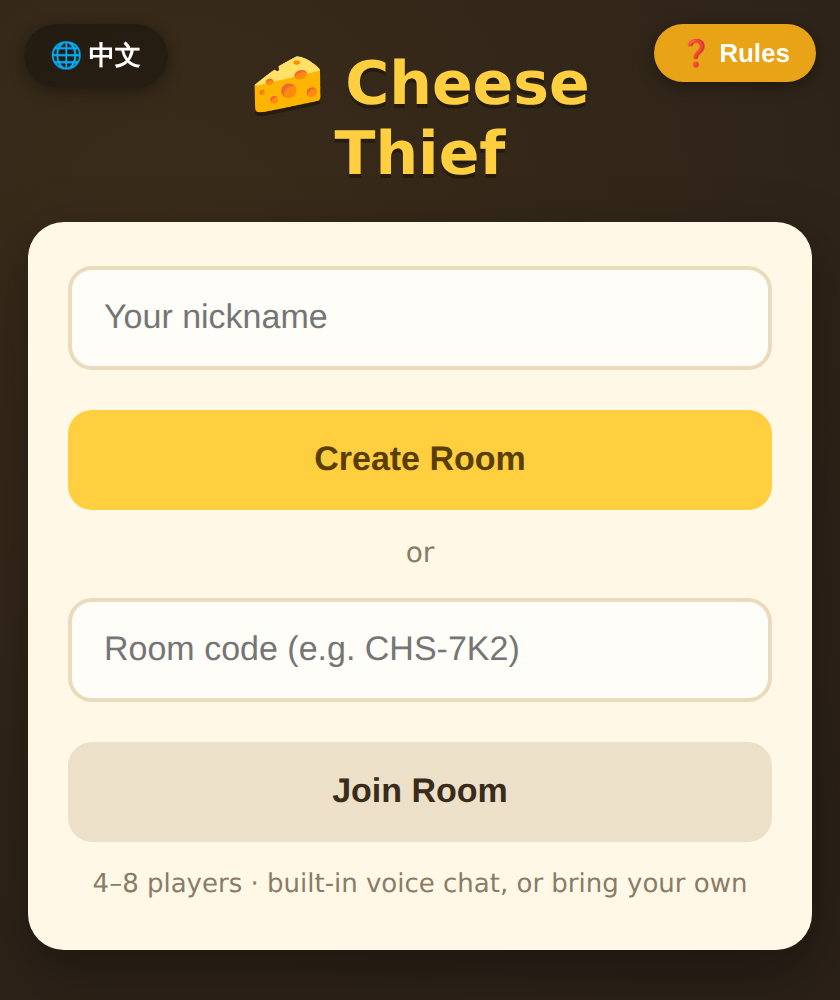

<div align="center">

# 🧀 奶酪大盗 · Cheese Thief

**深夜里，谁偷走了奶酪？—— 4–8 人在线社交推理小游戏**

免下载 · 免注册 · 无后端 · 中英双语 · 发个链接就能和朋友开一局

[](https://fanyiyang.github.io/cheese-thief/)

[](https://github.com/fanyiyang/cheese-thief/actions/workflows/test.yml)
[](LICENSE)


   

</div>

## ⚡ 30 秒开一局

1. 打开 **[fanyiyang.github.io/cheese-thief](https://fanyiyang.github.io/cheese-thief/)**，输入昵称，点 **创建房间**
2. 把房间号（如 `CHS-7K2`）或链接扔进微信群 / Discord
3. 凑满 **4–8 人**，房主点 **开始游戏** —— 完事，就这么简单

> 手机、平板、电脑浏览器都能玩，手机上还能「添加到主屏幕」当 App 用。左上角 🌐 一键切换中文/English。内置点对点语音/视频（右下角 🎙️📷），也可以直接用微信/Discord 开黑。

## 🕵️ 怎么玩

每人一张隐藏身份：🐭 **睡鼠** 或 🧀 **奶酪大盗**，外加骰子决定你在六个夜晚中的哪一晚睁眼。

规则**按人数自动切换**（忠于官方规则书，无需手动设置）：

| 人数 | 骰子 | 偷看 | 共犯 |
|---|---|---|---|
| **5–8 人**（基础局） | 每人 1 颗 | 独自睁眼可偷看 | 有（1/1/2/2 名） |
| **4 人**（官方变体） | 每人 2 颗 | 无 | 无 |

- **夜晚（1→6 晚，每晚 10 秒）**：轮到你的点数那晚你会睁眼。**同一晚睁眼的人能互相看见**。
- 大盗在自己睁眼的那晚**必须偷走奶酪** —— 同晚睁眼的人会亲眼看到是谁干的（关键线索！）。
- **白天**：语音对质、互相甩锅、找出破绽。
- **投票**：全员同时指认。**票最多者出局，平票全部出局**，翻牌验明正身。
  - 投出大盗 → 🐭 睡鼠阵营胜利；投出睡鼠或共犯 → 🧀 大盗阵营胜利。

<details>
<summary><b>📖 展开完整规则细节</b></summary>

1. **选醒来之夜**（仅 4 人变体）：两颗点数不同的睡鼠挑其中一个点数睁眼；大盗两点不同则两晚都睁、点数相同只睁一次。5–8 人局每人只有一颗骰子，睁眼夜固定。
2. 大盗在自己睁眼的夜晚拿走奶酪（4 人变体睁两晚时自己挑一晚）。
3. **偷看**（仅 5–8 人）：某晚**独自**睁眼的睡鼠，可点一名玩家头像偷看其骰子点数。4 人变体无偷看。
4. **共犯**（仅 5–8 人，与大盗共享胜利）：
   - **5 人**：大盗睁眼那晚，同晚睁眼者**当场**成为共犯（多人同晚由大盗当场指定一人；无人同晚则本局无共犯）。
   - **6 人**：数完第 6 晚后大盗挑 1 人，两人相认。
   - **7 人**：大盗挑 2 人，两名共犯彼此相认但**不知道**大盗是谁。
   - **8 人**：大盗挑 2 人，三人相认。
5. 天亮后界面醒目提示「奶酪不见了！！！」。
6. 右下角 **📜 我的记录** 可以回看你这一局的全部经历（睁眼见闻、偷看结果等）。

规则来源：官方《奶酪大盗 Cheese Thief》规则书扫描页见 [`docs/rules/`](docs/rules/)（含 4 人变体 + 5–8 人共犯规则）。

</details>

## ✨ 为什么值得一试

- **🚀 零门槛**：纯网页，没有 App、没有账号、没有服务器排队 —— 链接一发，人齐就开。
- **🌐 中英双语**：左上角一键切换，和外国朋友也能开一局。
- **🔒 身份真保密**：房主的浏览器当「裁判」，只把 *你自己的* 身份和骰子私发给你，别人的身份根本不会经过你的设备。
- **🌙 沉浸夜晚**：星空圆桌、月相计数、夜钟音效，同晚睁眼者互相可见，偷奶酪全程「目击」。
- **🎙️ 内置语音 / 视频**：点对点 WebRTC，夜晚自动静音防漏嘴，视频画质随网络自适应。
- **🔌 断线不慌**：固定身份号 + 掉线保位 + 状态恢复，刷新页面也能原位归队。

## 🛠️ 技术上是个啥

一句话：**纯静态单页 + WebRTC 玩家直连，托管在 GitHub Pages 上，没有任何后端。**

```
浏览器(房主) ←──── PeerJS DataConnection ────→ 浏览器(玩家 ×3~7)
     │ 房主 = 权威裁判：发牌、计时、算票
     │ 信令走 PeerJS 免费公共服务器，游戏数据全程点对点
     │
     └── js/game.js    纯逻辑（发牌/骰子/计票/共犯），零依赖、可单测
         js/net.js     PeerJS 薄封装（host / client，支持 ?server= 自建信令）
         js/host.js    房主权威游戏流程（数夜/偷奶酪/共犯/结算）
         js/client.js  加入房间 / 断线重连 / 消息处理
         js/render.js  全部界面渲染
         js/i18n.js    中英双语文案
         js/media.js   语音视频 mesh + 网络自适应画质
         js/audio.js   合成音效 · js/log.js 个人记录 · js/state.js 共享状态
```

- 无构建步骤：`HTML/CSS/JS` 直接部署，改完刷新即生效。
- 唯一外部依赖是 CDN 引入的 [PeerJS](https://peerjs.com/)。
- **自建信令后备**：公共 PeerJS 服务器不稳时，可自建 [PeerServer](https://github.com/peers/peerjs-server) 并用 `?server=host:port/path` 打开页面，「复制房间号链接」会自动带上该参数，全房间走同一台服务器。

## 🧑‍💻 本地开发

```bash
# 纯逻辑单元测试 + 缓存版本一致性检查（无需安装任何依赖）
npm test

# 端到端测试：无头浏览器里真实跑完一整局 4 人游戏
#（建房 → 加入 → 发牌 → 选夜 → 6 晚计数 → 偷奶酪 → 投票 → 结算 → 中英切换）
npm i --no-save playwright && npx playwright install chromium
npm run test:e2e

# 本地预览（任选其一）
python3 -m http.server 8091
# 浏览器打开 http://localhost:8091，多开几个标签页即可自己陪自己玩
```

> 改了 `js/` 或 `style.css` 记得同步把所有 `?v=N` 版本号 +1（`npm test` 会检查一致性，CI 会检查是否忘了 bump）。

## ⚠️ 已知限制

- 房主掉线则本局作废回大厅（玩家掉线可以重连，房主不行）。
- 内置语音是点对点：极少数对称 NAT 网络可能连不上，退回微信/Discord 即可。
- 游戏进行中不接受新玩家加入（等本局结束）。

## 🌍 English

**Cheese Thief** is a 4–8 player social-deduction party game you play in the browser — no download, no signup, no backend, **fully bilingual (中文/English, toggle in the top-left corner)**. One player hosts a room, shares a code, and everyone else joins over peer-to-peer WebRTC (PeerJS). Each player secretly wakes on certain nights; the thief steals the cheese on one of theirs, and anyone awake that night sees it happen. Discuss by day, vote out the thief — or get away with the cheese.

**[Play it here →](https://fanyiyang.github.io/cheese-thief/?lang=en)**



## 📄 许可

[MIT](LICENSE) — 随便玩，随便改，欢迎 PR 和 Star ⭐
